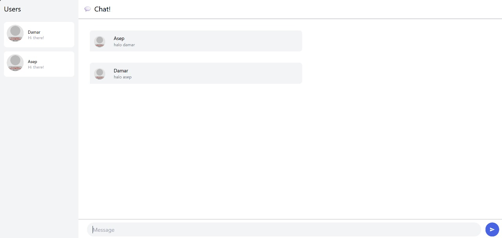

# Advprog-modul10-YewWebChat

Nama: Athallah Damar Jiwanto  
NPM: 2306245024  
Kelas: Advprog-B

## Experiment 3.1: Original code

Disini kita perlu menjalankan terlebih dahulu SimpleWebSocketServer yang sudah disediakan oleh jtordgeman. Baru habis itu jalankan di repo YewChat. Terlihat kita sudah bisa saling chat secara realtime di server tersebut.