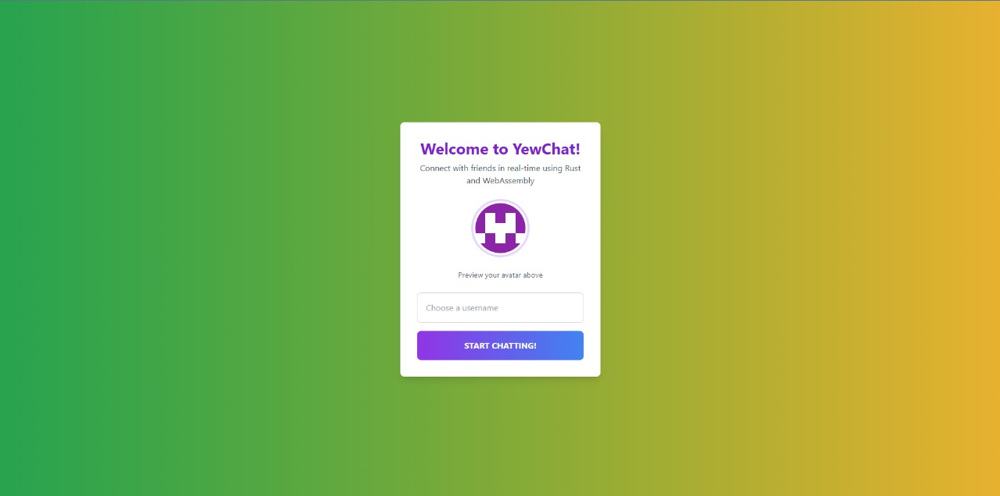
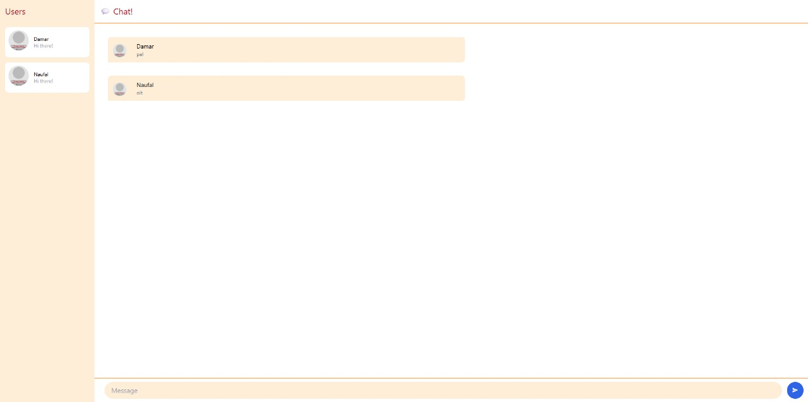

# Advprog-modul10-YewWebChat

Nama: Athallah Damar Jiwanto  
NPM: 2306245024  
Kelas: Advprog-B

## Experiment 3.1: Original code

Disini kita perlu menjalankan terlebih dahulu SimpleWebSocketServer yang sudah disediakan oleh jtordgeman. Baru habis itu jalankan di repo YewChat. Terlihat kita sudah bisa saling chat secara realtime di server tersebut.

## Experiment 3.2: Be Creative!

Saya mengubah halaman login agar tidak terlalu plain, dengan mengubah warna backgroundnya menjadi campuran Green dan Yellow. Lalu, Menambahkan Text Welcome dan preview avatar yang akan digunakan. Selain itu, mengubah juga warna chat page menjadi kombinasi warna merah dan oranye. Jadi, disini saya lebih mengubah dari segi estetika dan tidak menambahkan fitur tambahan.